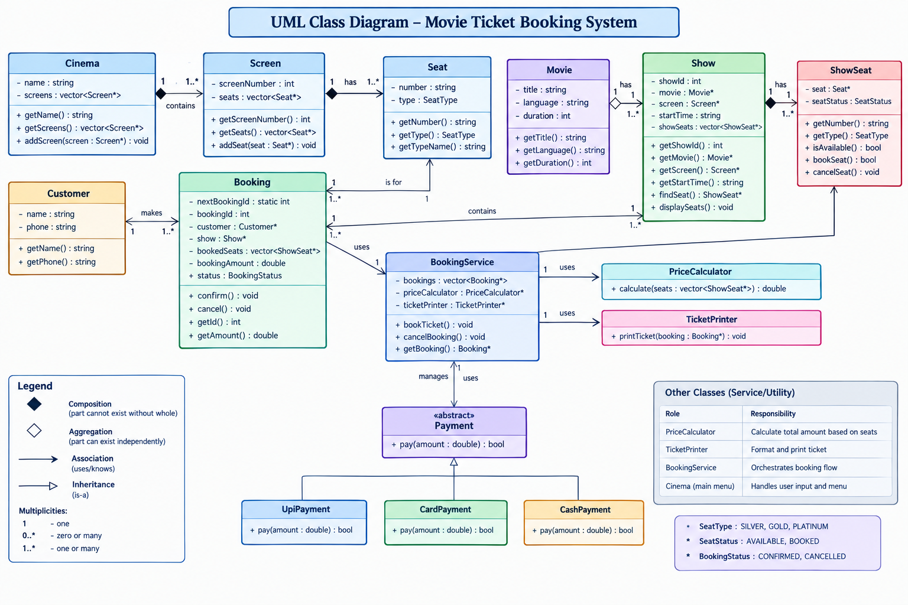
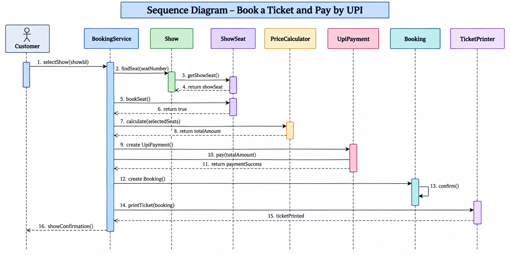

# 🎬 Movie Ticket Booking System

A menu-driven **Movie Ticket Booking System** developed in **C++** using Object-Oriented Programming (OOP) concepts and SOLID design principles.

The system simulates the movie ticket booking process for a single cinema. Users can browse movies, view available shows and seats, book tickets, select a payment method, generate tickets, and cancel bookings.

---

## ✨ Features

- 🎥 Display currently playing movies
- 🕒 View available shows and timings
- 🪑 View seat availability
- 🎟️ Book one or multiple seats
- ❌ Prevent booking of already-booked seats
- 💰 Automatic seat-based price calculation
- 💳 Multiple payment methods
  - UPI
  - Card
  - Cash
- ⚠️ Failed payment handling
- 🧾 Automatic ticket generation
- 🔢 Unique booking IDs
- 🔄 Booking cancellation
- ♻️ Seats become available again after cancellation
- 🛡️ Basic input validation

---

## 🛠️ Technologies Used

- **Language:** C++
- **Programming Paradigm:** Object-Oriented Programming
- **Application Type:** Console-Based Application
- **Design Principles:** SOLID Principles

---

# 📂 Project Structure

```text
Movie-Ticket-Booking-System/
│
├── src/
│   ├── main.cpp
│   ├── Movie.cpp
│   ├── Seat.cpp
│   ├── Screen.cpp
│   ├── Cinema.cpp
│   ├── Show.cpp
│   ├── ShowSeat.cpp
│   ├── Customer.cpp
│   ├── Booking.cpp
│   ├── BookingService.cpp
│   ├── Payment.cpp
│   ├── UpiPayment.cpp
│   ├── CardPayment.cpp
│   ├── CashPayment.cpp
│   ├── PriceCalculator.cpp
│   └── TicketPrinter.cpp
│
├── diagrams/
│   ├── class-diagram.png
│   └── sequence-diagram.png
│
├── screenshots/
│   ├── 01-menu.png
│   ├── 02-seats.png
│   ├── 03-booking.png
│   ├── 04-ticket.png
│   ├── 05-payment-failed.png
│   └── 06-cancellation.png
│
├── docs/
│   └── Assignment-1.pdf
│
├── README.md
└── .gitignore
```
---

# 🧱 UML Class Diagram



---
# 🔄 Sequence Diagram



---
# 👩‍💻 Author

**Heena**  
B.Tech Computer Science Engineering  
Specialization: Artificial Intelligence & Machine Learning
